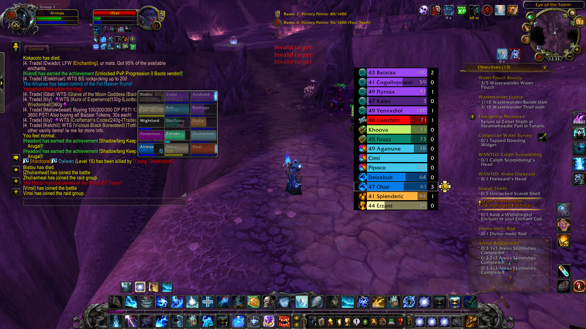

# BattlegroundTargets — Conquest of Azeroth

Battleground enemy target frames for Ascension's **Conquest of Azeroth** 3.3.5 client.

## Features

- Fast click-to-target enemy frames for target calls.
- Native Ascension icons for the 21 Conquest of Azeroth classes.
- Class colours supplied by the Ascension client.
- Enemy health information is shown whenever the client receives it.
- Support for Southshore vs. Tarren Mill.

## Installation

1. Download the latest release ZIP from [Releases](../../releases).
2. Extract the `BattlegroundTargets` folder into your Ascension client's `Interface\\AddOns\\` directory.
3. Start the game, or use `/reload` **outside** a battleground.
4. Use `/bgt` to configure the addon. Enable **Show Class Icon** for class icons.

## Notes

Enemy health can only update when the WoW client learns it, for example from a target, focus, mouseover or combat-log event. This is an API limitation of the 3.3.5 client.

## Credits

- Original BattlegroundTargets by kunda.
- 3.3.5 port by Exad / [BGT-Epoch](https://github.com/MCribari/BGT-Epoch).
- Conquest of Azeroth compatibility package by **Airmax**.

## License

GPL-3.0-or-later. See [LICENSE.txt](LICENSE.txt).
